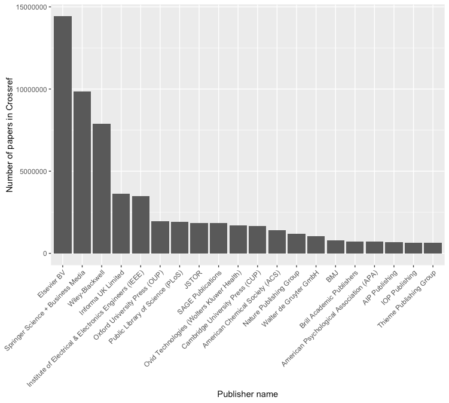

<!--- A submission for LIBER journal
https://www.liberquarterly.eu/about/submissions/ 

Markdown citations:

pandoc -s -S --bibliography biblio.bib --filter pandoc-citeproc CITATIONS -o example24a.html

pandoc -s -S --bibliography biblio.json --filter pandoc-citeproc --csl chicago-fullnote-bibliography.csl CITATIONS -o example24b.html

pandoc -s -S --bibliography biblio.yaml --filter pandoc-citeproc --csl ieee.csl CITATIONS -t man -o example24c.1

---->

<!--- 
Case studies present in depth studies of particular situations in an illustrative way, without restricting themselves to a single research procedure. A case study records the practices of the profession by narrowing down a very broad field of research into one, real-world topic and providing factual evidence and revealing facts or information otherwise ignored or unknown. While critical judgment and organization of the material are required, generally, writers should stick to the facts by providing a fairly modest and honest record of the events. With a short introduction, a case study should provide an explanation, why is the given case particularly interesting. The case study has to contain the most important information obtained about it, followed by a plan for analysing the problem at hand and the options to solve it. 
--->

The scientific literature is the greatest source of knowledge mankind has ever produced, but it can be built upon by mining information from it. With the fourth industrial revolution upon us, the information revolution, the scientific literatures aggregate information is ripe for the pickings. Information can be mined from text- and data in previous research articles in order to create new knowledge. This methodology, Text- and Data Mining (TDM), contains many fruitful possibilities, including an automated hypothesis finder [@malhotra2013], semi-automated meta-analysis procedures [], statistical error detection [], and in my case, detecting potential data fabrication in the sciences. This list is hardly extensive, and the potential to innovate is great. 

However, researchers wanting to apply these methods face tremendous problems because in order to analyse these articles, they first need to be downloaded. 

Downloading does not need to be difficult, considering that an automated download for all scientific literature could ideally require only one line of code. However, the infrastructure to do this has to be built, and the downloads have to be facilitated by the publishers. For example, the publisher PeerJ encourages TDM based on its corpus and places no restrictions on the downloading of articles. As a result, one needs only the following code to download the entire corpus

`curl -s peerj.com/articles/updat… | csvcut -c url | tail -n +2 | while read -r u; do curl -H "Accept:application/jats+xml" -O -J -L "$u"; done`

.publisher's entire corpus can be downloaded with a single line of code., if 

https://hypothes.is/stream?q=user:chjh

**Figure `r fig <- 1;fig`.** Publications per publisher available in CrossRef. *Image credit: Richard Smith-Unna.*

# 